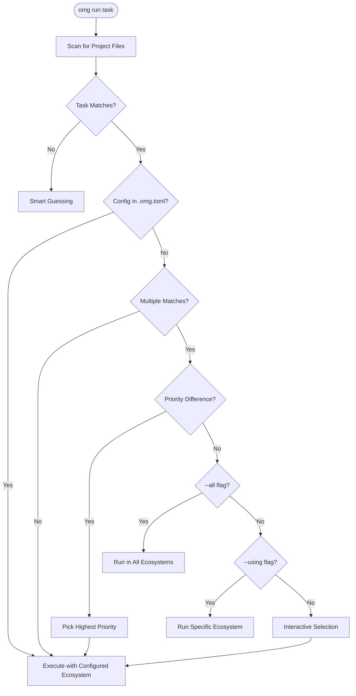

# Task Runner

**Unified Task Execution Across All Ecosystems**

OMG's task runner (`omg run`) automatically detects project types and executes tasks with the correct runtime environment, eliminating the need to remember different commands for different ecosystems.

---

## 🎯 Overview

Instead of remembering:
- `npm run dev` or `yarn dev` or `pnpm dev` or `bun dev`
- `cargo test` or `make test` or `poetry run test`
- Which package manager to use for each project

Just use:
```bash
omg run dev
omg run test
omg run build
```

OMG automatically:
1. **Detects** the project type from config files
2. **Activates** the correct runtime version (from `.nvmrc`, etc.)
3. **Selects** the appropriate package manager
4. **Executes** the task with proper arguments

---

## 📋 Supported Project Types

| Config File | Detected Runtime | Task Execution |
|-------------|------------------|----------------|
| `package.json` | Node.js/Bun | npm/yarn/pnpm/bun |
| `deno.json` | Deno | `deno task` |
| `Cargo.toml` | Rust | `cargo` |
| `Makefile` | Make | `make` |
| `Taskfile.yml` | Task | `task` |
| `pyproject.toml` | Python (Poetry) | `poetry run` |
| `Pipfile` | Python (Pipenv) | `pipenv run` |
| `composer.json` | PHP (Composer) | `composer run-script` |
| `pom.xml` | Java (Maven) | `mvn` |
| `build.gradle` | Java (Gradle) | `gradle` |

---

## 🚀 Basic Usage

### Running Tasks

Tasks allow you to interact with your project's lifecycle without needing to remember ecosystem-specific commands.

*   **Action Execution**: Run named tasks defined in your project configuration (e.g., `dev`, `test`, `build`).
*   **Dynamic Discovery**: View all tasks supported by your current project type.
*   **Parameter Passing**: Forward custom flags and arguments directly to the underlying tool.

### How Tasks Are Resolved

The system uses a sophisticated 11-tier discovery engine to determine the correct execution path, now enhanced with an intelligent priority hierarchy and ambiguity resolution:

1.  **Project Identification**: The system performs a breadth-first search for configuration patterns across 11 distinct project types, including Rust (Cargo), Node.js/Bun, Python (Poetry/Pipenv), Java (Maven/Gradle), PHP (Composer), and Deno.
2.  **Ecosystem Priority**: If a task name exists in multiple ecosystems (e.g., both `Cargo.toml` and `package.json`), OMG uses a weighted priority system:
    *   **Rust (Cargo)**: 100
    *   **JavaScript/TypeScript (Node/Bun)**: 90
    *   **Python (Poetry/Pipenv)**: 80
    *   **Go (Task)**: 75
    *   **Ruby (Rake)**: 70
    *   **Java (Maven/Gradle)**: 60
    *   **PHP (Composer)**: 50
    *   **Make**: 40
3.  **Ambiguity Resolution**: If priorities are equal or user preferences are not defined, OMG will:
    *   **Interactive Prompt**: Ask you which ecosystem you intended to use.
    *   **Explicit Override**: Respect the `--using <ecosystem>` flag (e.g., `omg run test --using node`).
    *   **Multi-Execution**: Run across all detected ecosystems if the `--all` flag is provided.
4.  **Project Configuration**: You can permanently resolve ambiguity by creating a `.omg.toml` file in your project root:
    ```toml
    [scripts]
    test = "rust"
    build = "node"
    ```
5.  **Runtime Activation**: Before execution, the system detects and activates the required runtime version from files like `.nvmrc` or `rust-toolchain.toml`.
6.  **Manager Selection**: For multi-manager ecosystems (like JavaScript), the system follows a strict priority logic:
    *   Explicit `packageManager` field in the configuration.
    *   Lockfile detection (prioritizing modern alternatives like `bun.lockb` or `pnpm-lock.yaml`).
    *   System default (falling back to standard managers if no preference is found).
7.  **Task Matching**: Discovered scripts or targets are matched against the user request and executed within the optimized environment.

### 🔄 Resolution Flow



---

## 🛠️ Advanced Options

| Flag | Description | Example |
|------|-------------|---------|
| `--using` | Force a specific ecosystem | `omg run test --using rs` |
| `--all` | Run task in all detected ecosystems | `omg run build --all` |
| `--watch`, `-w` | Re-run on file changes | `omg run test --watch` |
| `--parallel`, `-p` | Run multiple tasks in parallel | `omg run build,test -p` |

---

## 📦 JavaScript/TypeScript Projects

### Package Manager Detection

OMG selects the package manager in this order:

1. **`packageManager` field** in `package.json` (highest priority)
2. **Lockfile detection**:
   - `bun.lockb` → Bun
   - `pnpm-lock.yaml` → pnpm
   - `yarn.lock` → Yarn
   - `package-lock.json` → npm
3. **Default**: Bun (if installed) → npm (fallback)

### Examples

```bash
# Project with package.json
omg run dev        # → npm run dev (or bun/yarn/pnpm)
omg run build      # → npm run build
omg run test       # → npm run test

# With arguments
omg run test -- --coverage
```

### packageManager Field

OMG respects the `packageManager` field in `package.json`:

```json
{
  "name": "my-app",
  "packageManager": "bun@1.1.0"
}
```

This ensures all team members use the same package manager version.

Supported values:
- `bun@1.1.0`
- `pnpm@9.0.0`
- `yarn@4.0.0`
- `npm@10.0.0`

### Corepack Integration

If `packageManager` specifies pnpm or yarn, OMG can enable them via corepack:

```bash
# OMG will prompt:
# "pnpm is not installed. Enable via corepack? [Y/n]"
omg run dev
```

### Runtime Version Detection

OMG checks for Node/Bun version files:

| File | Example Content |
|------|-----------------|
| `.nvmrc` | `20.10.0` |
| `.node-version` | `20` |
| `.bun-version` | `1.0.25` |
| `package.json` engines | `{ "node": ">=18" }` |
| `package.json` volta | `{ "node": "20.10.0" }` |

---

## 🦀 Rust Projects

### Detection

Rust projects are detected by `Cargo.toml`.

### Task Mapping

| omg run | cargo equivalent |
|---------|------------------|
| `omg run build` | `cargo build` |
| `omg run test` | `cargo test` |
| `omg run run` | `cargo run` |
| `omg run check` | `cargo check` |
| `omg run bench` | `cargo bench` |
| `omg run doc` | `cargo doc` |
| `omg run fmt` | `cargo fmt` |
| `omg run clippy` | `cargo clippy` |

### Examples

```bash
# Build release
omg run build -- --release

# Run with arguments
omg run run -- --help

# Test specific module
omg run test -- tests::my_test
```

### Toolchain Detection

OMG reads `rust-toolchain.toml`:

```toml
[toolchain]
channel = "1.75.0"
components = ["rustfmt", "clippy"]
```

The correct toolchain is activated before running tasks.

---

## 🐍 Python Projects

### Poetry Projects (pyproject.toml)

For projects with Poetry:

```bash
omg run serve     # → poetry run serve
omg run test      # → poetry run pytest
omg run lint      # → poetry run lint
```

### Pipenv Projects (Pipfile)

For projects with Pipenv:

```bash
omg run dev       # → pipenv run dev
omg run test      # → pipenv run test
```

### Virtual Environment Activation

OMG automatically activates the correct Python version from `.python-version`:

```bash
# When .python-version contains "3.12.0"
omg run test
# Runs with Python 3.12.0 activated
```

---

## 🔨 Makefile Projects

### Detection

Projects with `Makefile` in the root.

### Task Mapping

Make targets become `omg run` tasks:

```makefile
# Makefile
build:
	go build -o bin/app

test:
	go test ./...

clean:
	rm -rf bin/
```

```bash
omg run build   # → make build
omg run test    # → make test
omg run clean   # → make clean
```

### Listing Targets

```bash
omg run --list
# Build targets:
#   build - Build the application
#   test  - Run tests
#   clean - Clean build artifacts
```

---

## 📋 Taskfile Projects

### Detection

Projects with `Taskfile.yml` or `Taskfile.yaml`.

### Example Taskfile

```yaml
# Taskfile.yml
version: '3'

tasks:
  build:
    cmds:
      - go build -o bin/app
    desc: Build the application

  test:
    cmds:
      - go test ./...
    desc: Run tests
```

### Usage

```bash
omg run build   # → task build
omg run test    # → task test
```

---

## ☕ Java Projects

### Maven (pom.xml)

```bash
omg run test     # → mvn test
omg run package  # → mvn package
omg run install  # → mvn install
omg run clean    # → mvn clean
```

### Gradle (build.gradle)

```bash
omg run test     # → gradle test
omg run build    # → gradle build
omg run run      # → gradle run
```

---

## 🦕 Deno Projects

### Detection

Projects with `deno.json` or `deno.jsonc`.

### Example

```json
{
  "tasks": {
    "dev": "deno run --watch main.ts",
    "test": "deno test"
  }
}
```

```bash
omg run dev    # → deno task dev
omg run test   # → deno task test
```

---

## 🐘 PHP Projects

### Composer (composer.json)

```json
{
  "scripts": {
    "test": "phpunit",
    "lint": "phpcs"
  }
}
```

```bash
omg run test   # → composer run-script test
omg run lint   # → composer run-script lint
```

---

## ⚙️ Runtime Backend Options

Control how runtimes are resolved:

```bash
# Force native OMG managers
omg run --runtime-backend native dev

# Force mise
omg run --runtime-backend mise dev

# Default: native-then-mise
omg run dev
```

Configuration in `~/.config/omg/config.toml`:

```toml
runtime_backend = "native-then-mise"
```

---

## 🔄 Auto-Install Prompts

When required tools are missing, OMG prompts to install:

### Rust Toolchains

```bash
$ omg run build
# rust-toolchain.toml specifies 1.75.0
# → "Rust 1.75.0 not installed. Install now? [Y/n]"
```

### Node.js Versions

```bash
$ omg run dev
# .nvmrc specifies 20.10.0
# → "Node 20.10.0 not installed. Install now? [Y/n]"
```

### Package Managers

```bash
$ omg run dev
# packageManager: "pnpm@9.0.0"
# → "pnpm not installed. Enable via corepack? [Y/n]"
```

---

## 📊 Task Discovery

### List Available Tasks

```bash
omg run --list
```

Output varies by project type:

**For package.json:**
```
JavaScript Tasks (via npm):
  dev         - Start development server
  build       - Build for production
  test        - Run tests
  lint        - Run linter
```

**For Cargo.toml:**
```
Cargo Tasks:
  build       - Compile the project
  test        - Run tests
  run         - Run the main binary
  check       - Check for errors
```

**For Makefile:**
```
Make Targets:
  all         - Build everything
  test        - Run tests
  clean       - Clean build artifacts
```

---

## 🎯 Best Practices

### 1. Use Version Files

Always include version files for reproducibility:

```bash
# Node.js project
echo "20.10.0" > .nvmrc

# Python project
echo "3.12.0" > .python-version

# Rust project
cat > rust-toolchain.toml << 'EOF'
[toolchain]
channel = "stable"
EOF
```

### 2. Use packageManager Field

For JavaScript projects, specify the package manager:

```json
{
  "packageManager": "bun@1.1.0"
}
```

### 3. Document Available Tasks

Use descriptive script names and comments:

```json
{
  "scripts": {
    "dev": "vite",
    "build": "vite build",
    "test": "vitest",
    "test:watch": "vitest --watch",
    "lint": "eslint src/"
  }
}
```

### 4. Capture Environment

Lock the complete environment:

```bash
omg env capture
git add omg.lock
git commit -m "chore: update environment lockfile"
```

---

## 🔧 Troubleshooting

### Wrong Runtime Version

```bash
# Check which version is active
omg which node

# Force specific version
omg use node 20.10.0

# Run task with explicit version
omg run dev
```

### Task Not Found

```bash
# List available tasks
omg run --list

# Check project file is detected
ls -la package.json Cargo.toml Makefile

# Try direct execution
npm run dev
```

### Wrong Package Manager

```bash
# Check detected package manager
omg run --list
# Shows "via npm" or "via bun" etc.

# Set explicitly in package.json
{
  "packageManager": "pnpm@9.0.0"
}
```

---

## 📚 See Also

- [Runtime Management](./runtimes.md) — Version file formats and runtime setup
- [Shell Integration](./shell-integration.md) — PATH management
- [Configuration](./configuration.md) — runtime_backend setting
- [Workflows](./workflows.md) — Complete project setup workflows
