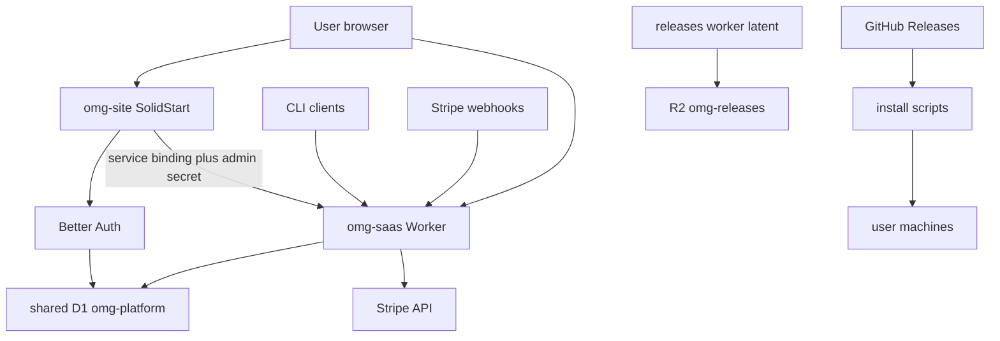

# omg-web Threat Model

**Date:** 2026-08-23 · **Head reviewed:** `6eb3c8e` (+ working tree) · **Method:** 7 parallel read-only audits (auth/sessions, API-keys/licenses, Stripe billing, request surface, frontend, data layer, supply chain), orchestrator-verified top findings. Per-agent reports: `~/.cache/build-targets/omg-web-security-review/findings/`.

## Executive summary

omg-web is a Cloudflare Workers SaaS platform that issues paid license/API keys, processes Stripe payments, and serves a SolidStart marketing/dashboard site sharing one D1 database. The strongest risk theme is **identity binding by bare email across three independent identity systems** (Better Auth site accounts, Worker OTP sessions, Stripe customers): an unverified email/password signup can be bound to an existing paid customer row and yield full paid-key theft (TM-001). Second, the **revenue enforcement path has direct bypasses**: `machine_id` is optional, so one paid key validates unlimited machines (TM-002), and offline license tokens fall back to HS256, which is incompatible with secure client-side verification (TM-004). Third, the **software distribution channel ships unverified executables** via `curl | bash` while the pricing page advertises nonexistent SLSA provenance (TM-003). A cluster of medium findings covers payment-state races, tier-vs-status authorization drift, OTP abuse, metric poisoning, plaintext credential storage, and a single shared admin secret that confers self-service role elevation. Existing controls are genuinely good in places (timing-safe secret compare, HMAC'd OTPs, parameterized SQL everywhere, fixed CORS allowlist, signed webhooks with replay protection) — the gaps are almost all authorization-decision and lifecycle problems, not injection-class bugs.

## Scope and assumptions

**In scope:** `site/workers/**` (licensing/billing/auth Workers), `site/src/**`, `site/shared/**`, `workers/router/**`, `workers/releases/**`, `tools/**`, `.github/workflows/ci.yml`, all wrangler configs, migrations, `site/public/install.*`.

**Out of scope:** the out-of-repo Rust CLI (`PyRo1121/omg`) — its verifier behavior decides TM-004/TM-011; Stripe Dashboard configuration; production D1 contents; Cloudflare zone/WAF settings not represented in wrangler configs.

**Key assumptions (unverified — see Open Questions):**

- Production secrets (`ADMIN_API_SECRET`, `JWT_SECRET`, `STRIPE_*`) are high-entropy Wrangler secrets; none were read.
- `JWT_PRIVATE_KEY` (EdDSA) is _not_ documented among configured secrets; the HS256 fallback is assumed active until proven otherwise.
- Paid customers can exist (via Stripe webhook or legacy OTP flow) before registering a Better Auth account — code paths support this; no invariant prevents it.
- `workers/router` and `workers/releases` are currently undeployed (live-checked); their findings are deployment-gated.
- Rate-limiter bindings in `wrangler.toml` are deployed; code fails open if a binding is missing.

**Open questions that materially change ranking:** (1) Does the CLI verify license JWTs offline, and with which algorithm/key? (2) Is `JWT_PRIVATE_KEY` configured in production? (3) Are there real paid customers without a verified Better Auth account today? (4) Is Worker OTP delivery enabled on the current plan (docs say deferred)?

## System model

### Primary components

- **omg-site** (`site/`): SolidStart SSR site on `omg.latham.cloud` — Better Auth (cookie sessions, email+password + OAuth-ready), dashboard UI, licensing BFF (`site/src/lib/licensing-bff.ts`) that mints Worker sessions server-side via service binding.
- **omg-saas** (`site/workers/`): licensing Worker on public `omg-api.latham.cloud` — OTP auth, license validation/JWT minting, telemetry ingest, Stripe webhooks, admin CRM/analytics, privacy endpoints. Shares D1 `omg-platform` with omg-site.
- **D1 `omg-platform`**: single shared database — auth tables (Better Auth), customers/licenses/machines/sessions, Stripe inbox, raw telemetry, audit log.
- **Stripe**: checkout/portal + signed webhook ingestion with durable event dedup.
- **Latent edge workers**: `workers/router` (docs proxy), `workers/releases` (R2 release server, bucket exists, worker undeployed).
- **Distribution**: `install.sh`/`install.ps1` static assets + GitHub Releases artifacts; `curl | bash` bootstrap.
- **CI**: single workflow, read-only, no secrets, no deploy job (deploys are manual from dev machines).

### Data flows and trust boundaries

- **Internet → omg-saas** (public HTTPS): anonymous license keys, OTP codes, telemetry JSON, Stripe webhooks. Controls: route allowlist, Turnstile (send-code, fail-closed), per-IP rate limiters, Stripe HMAC signature + timestamp window + event-ID dedup, Effect Schema body decoding. Gaps: no limiter on verify-code, no size cap before parse on two ingest routes.
- **Browser → omg-site BFF → omg-saas** (service binding + `X-Admin-Secret` = `ADMIN_API_SECRET`): Better Auth identity projected into Worker session by **email lookup**. Controls: same-origin check on mutations, route allowlist, server-only token. Gaps: email treated as authoritative identity; caller-supplied `role` honored; `X-Internal-Call` marker forgeable (not the real control).
- **CLI/client → /api/validate-license**: bearer license key (query or body) → signed offline JWT containing tier/features and the **raw key**. No account session; optional machine identity.
- **Worker → D1**: all parameterized; both Workers share full-database bindings with convention-only table ownership.
- **GitHub Releases / R2 → user machines**: installer downloads executable artifacts with **no signature verification** (POSIX path).

#### Diagram

## Assets and security objectives

| Asset                                               | Why it matters                                        | Objective                                        |
| --------------------------------------------------- | ----------------------------------------------------- | ------------------------------------------------ |
| License/API keys (`licenses.license_key`)           | Direct paid entitlement, distributed to many machines | Confidentiality, rotation integrity              |
| Customer rows + email identity map                  | Join point of three identity systems; PII             | Integrity (binding correctness), confidentiality |
| Stripe linkage & subscription state                 | Drives paid entitlements                              | Integrity (ordering/freshness)                   |
| Offline license JWTs + signing keys                 | Grant tier/features offline                           | Integrity (forgery resistance)                   |
| `ADMIN_API_SECRET`, `JWT_SECRET`                    | Session minting, token signing, role elevation        | Confidentiality                                  |
| User sessions (Better Auth cookies, Worker bearers) | Account impersonation                                 | Confidentiality, revocability                    |
| D1 `omg-platform`                                   | Single store for everything above; free-tier capacity | Confidentiality, integrity, availability         |
| Release channel (installers, R2, GitHub Releases)   | Code execution on every user machine                  | Integrity                                        |
| Telemetry/business metrics + installs badge         | Product decisions, public trust                       | Integrity, availability                          |

## Attacker model

### Capabilities

- Anonymous internet clients against all public routes (including setting arbitrary headers such as `X-Internal-Call`).
- Any registered/free-tier customer: valid sessions, own license key, knowledge of arbitrary candidate emails.
- Paying subscribers manipulating their own subscriptions through Stripe's portal.
- Malicious team-member/insider holding a shared Team license key.
- (Supply-chain tier) a compromised maintainer identity or upstream release-publishing pipeline.

### Non-capabilities

- No assumed D1 read access short of a Cloudflare-credential incident (findings starting there are explicitly downgraded).
- No assumed ability to guess UUIDv4 license keys or break TLS.
- No assumed pre-knowledge of `ADMIN_API_SECRET`, `JWT_SECRET`, or Stripe webhook secrets.
- Router/releases findings assume future deployment; not live attack surface today.

## Entry points and attack surfaces

| Surface                                                                  | How reached                                  | Trust boundary                        | Notes                                                            | Evidence                                                                    |
| ------------------------------------------------------------------------ | -------------------------------------------- | ------------------------------------- | ---------------------------------------------------------------- | --------------------------------------------------------------------------- |
| `/signup`, Better Auth catch-all                                         | Browser, anonymous                           | Internet → site                       | Email+password, **no verification required**                     | `site/src/lib/auth.ts:63`, `signup.tsx`                                     |
| `/api/licensing/*` BFF                                                   | Any Better Auth session                      | Site → Worker (svc binding)           | Mints Worker session by email; forwards `role`                   | `site/src/lib/licensing-bff.ts`, `handlers/site-session.ts:mintSiteSession` |
| `/api/internal/site-session`                                             | Direct public HTTP possible                  | Forgeable header gate + shared secret | Real control is `ADMIN_API_SECRET`; body can set `role: 'admin'` | `worker.ts:255-262`, `admin-secret.ts`                                      |
| `/api/validate-license` GET/POST                                         | Anonymous, key as credential                 | None                                  | Optional `machine_id`; returns fleet PII; GET puts key in URL    | `contracts/validate-license.ts:31-46`, `license.ts:238-250`                 |
| `/api/get-license?email=`                                                | Session (was anonymous)                      | Weak object-level authz               | Cross-customer metadata enumeration                              | `license.ts:lookupPublicLicense`                                            |
| `/api/stripe/webhook`                                                    | Stripe (HMAC-gated)                          | Signature verified, deduped           | Projection ordering unguarded                                    | `billing.ts:479-652`                                                        |
| `/api/analytics`, `/api/install-ping`, `/api/report-usage`, `/api/cli/*` | Anonymous or any key                         | Rate limiters only                    | Anonymous lane bypasses telemetry policy; unbounded fields       | `license.ts:ingestAnalytics`, `telemetry-policy.ts`                         |
| `/api/admin/*`                                                           | Worker bearer + live `customers.admin` check | DB-flag-based                         | Stale flag after demotion; `/api/admin/health` ungated           | `admin-auth.ts`, `admin.ts:handleAdminHealth`                               |
| `install.sh` / GitHub Releases                                           | User shell                                   | None                                  | Unsigned artifact execution, `setcap` amplifier                  | `site/public/install.sh`, `Pricing.tsx:187`                                 |
| `releases.pyro1121.com` (latent)                                         | Future CLI self-update                       | None planned                          | Whole-bucket exposure, unsigned updates, workers.dev footgun     | `workers/releases/src/index.ts:23-74`                                       |

## Top abuse paths

1. **Paid-key theft via unverified signup (TM-001):** learn victim email → sign up with attacker password → open `/dashboard` → BFF binds by email → victim's license key, invoices, and account actions.
2. **Unlimited seats from one paid key (TM-002):** call `/api/validate-license` without `machine_id` → seat accounting skipped → distribute signed paid tokens/JWTs freely.
3. **User-machine RCE via update channel (TM-003):** compromise release publishing → trojaned "latest" tarball → `install.sh` executes it unverified; turbo mode adds filesystem capabilities.
4. **Offline Enterprise-token forgery (TM-004, conditional):** extract HS256 verifier secret from a shipped CLI → mint arbitrary tier/features/expiry tokens.
5. **Free Team features after cancel / chargeback-funded access (TM-006/TM-007):** cancel subscription or dispute charge → tier/status drift or missing dispute handling keeps paid surfaces usable.
6. **OTP lockout loop (TM-008):** know victim email → 5 junk verify attempts burn the shared counter → repeat per new code; broken send quota lets each Turnstile pass invalidate prior codes.
7. **Stale entitlement resurrection (TM-005):** rapid cancel/reactivate → older Stripe snapshot commits last → cancelled license returns to `active`.
8. **Former-admin persistence (TM-013):** demoted admin's `customers.admin=1` never resynced on OTP login → fresh 30-day admin session.
9. **Metric/D1 poisoning (TM-014):** anonymous `/api/analytics` flood → unbounded dimension rows, error text, firehose spam; `install-ping` inflates public badge.
10. **Production takeover via main (TM-017):** hijacked maintainer → push to unprotected main → manual deploy of Workers holding all secrets.

## Threat model table

| ID     | Threat source                           | Prerequisites                                                         | Threat action                                                                                                     | Impact                                              | Impacted assets                         | Existing controls (evidence)                                                                      | Gaps                                                                                                                                        | Recommended mitigations                                                                                                                            | Detection ideas                                                                      | Likelihood | Impact severity | Priority               |
| ------ | --------------------------------------- | --------------------------------------------------------------------- | ----------------------------------------------------------------------------------------------------------------- | --------------------------------------------------- | --------------------------------------- | ------------------------------------------------------------------------------------------------- | ------------------------------------------------------------------------------------------------------------------------------------------- | -------------------------------------------------------------------------------------------------------------------------------------------------- | ------------------------------------------------------------------------------------ | ---------- | --------------- | ---------------------- |
| TM-001 | Remote attacker                         | Victim email; paid customer row without Better Auth account           | Sign up unverified → email-bound Worker session → read/rotate victim key                                          | Full account takeover of paid licensing account     | License keys, billing data, PII         | Bearer stays server-side; same-origin on mutations; unique `auth_user.email`                      | No `requireEmailVerification`; `findCustomerByEmail` binds by bare email; `betterAuthUserId` ignored                                        | Require verified email; bind customers by immutable `betterAuthUserId` with one-time ownership-proof claim flow; fail closed on ambiguity          | Alert on `site.session_created` for pre-existing customers; audit duplicate bindings | High       | High            | **critical**           |
| TM-002 | Paying customer / key holder            | One valid paid key                                                    | Omit `machine_id` → bypass seat counting → unlimited activations                                                  | Revenue loss; entitlement model defeated            | Seat limits, revenue integrity          | Status/expiry checks; seat cap enforced when id present                                           | `machine_id` optional; null short-circuits before seat logic (`license.ts:248`)                                                             | Require canonical machine id; bind JWT to persisted machine row; invariant test: paid issuance always touches exactly one seat                     | Monitor validations with null mid on paid tiers                                      | High       | High            | **high**               |
| TM-003 | Supply-chain attacker                   | Compromise of release publishing (GitHub acct/repo)                   | Publish trojaned release → `install.sh` executes unverified binary                                                | RCE on all user endpoints; turbo `setcap` amplifier | User machines, brand trust              | HTTPS; Windows path verifies `.sha256`; secret scanning enabled                                   | POSIX script verifies nothing; advertised SLSA provenance doesn't exist                                                                     | Port sha256 check now; add minisign/ed25519 signature with embedded pubkey; implement or drop SLSA claim; reconsider auto-setcap                   | Release-monitoring webhook; reproducible-build diff                                  | Medium     | Critical        | **high**               |
| TM-004 | CLI reverse-engineer                    | HS256 fallback active; verifier secret shipped in client              | Extract HMAC secret → forge Enterprise offline JWTs                                                               | Payment-free entitlement forgery                    | JWT integrity, revenue                  | EdDSA implemented and preferred when configured (`license.ts:221-236`)                            | `JWT_PRIVATE_KEY` optional+undocumented; no alg pinning/iss/aud claims documented                                                           | Remove HS256 fallback for offline tokens; fail closed without Ed25519; pin alg + iss/aud/kid                                                       | Canary token alerts; CLI version telemetry                                           | Medium     | High            | **high** (conditional) |
| TM-005 | Subscriber                              | Ability to time subscription changes                                  | Race distinct webhook events → stale snapshot commits last → cancelled license reactivated                        | Unpaid access until next sync                       | Entitlement state, revenue              | Webhook HMAC; event-ID dedup lease; Stripe re-fetch; price allowlist (`stripe-reconciliation.ts`) | Lease keyed by event id, not subscription; unconditional last-writer-wins projection; no scheduled reconciliation                           | Serialize projection per subscription/customer (DO or D1 lease spanning fetch+commit); monotonic version + conditional writes; cron reconciliation | Alert on tier flip-flops; diff D1 vs Stripe daily                                    | Low–Med    | Med–High        | **medium**             |
| TM-006 | Cancelled subscriber                    | Cancelled Team sub keeps historical `licenses.tier='team'`            | Keep calling tier-guarded team endpoints                                                                          | Unpaid Team dashboard features                      | Feature gating integrity                | Routes session-scoped; core validator checks status                                               | Tier-vs-status authorization drift (`dashboard.ts:297-321`, `account-dashboard.ts:425-432`)                                                 | Single effective-entitlement guard (tier AND active status) applied to all paid routes                                                             | Log tier-granted-but-inactive accesses                                               | High       | Low–Med         | **medium**             |
| TM-007 | Fraudulent subscriber                   | Dispute/refund leaves subscription `active` (default Stripe behavior) | Buy → dispute → retain paid access                                                                                | Chargeback-funded usage                             | Revenue                                 | `invoice.payment_failed` audited; subscription status respected                                   | No dispute/refund events subscribed; no suspension state                                                                                    | Subscribe to dispute/refund events; suspend-on-dispute policy; enable/verify Stripe auto-cancel on dispute                                         | Finance alert on disputes; reconcile weekly                                          | Medium     | Medium          | **medium**             |
| TM-008 | Anonymous attacker                      | Victim email only                                                     | Burn OTP attempt counter (5 reqs); exploit broken send quota to rotate codes                                      | Auth denial-of-service for victim; OTP email abuse  | Availability, email reputation          | Atomic one-time code claim; Turnstile fail-closed on send; per-IP limiter                         | No limiter/challenge on verify-code; shared per-email counter; send quota counts after invalidation                                         | Flow-id-bound attempt counters; mandatory limiter on verify; count sends before invalidating                                                       | Alert on failed-verify bursts per email/IP                                           | High       | Medium          | **medium**             |
| TM-009 | Holder of leaked code/token             | Code observed before expiry date                                      | ISO-`T` vs SQLite space-separated TEXT comparison extends validity up to ~24h                                     | Extended replay window                              | Sessions, OTP integrity                 | Codes one-time, HMAC'd, 5 attempts                                                                | Mixed timestamp formats in expiry predicates (multiple sites)                                                                               | Canonicalize: `datetime(expires_at) > datetime('now')` or epoch integers; boundary tests                                                           | N/A (logic fix)                                                                      | Low        | Medium          | **low–medium**         |
| TM-010 | Low-privilege user                      | Own valid session                                                     | `/api/get-license?email=` enumerate paying customers' tier/status/expiry/fleet                                    | Targeted phishing/theft recon                       | Customer privacy                        | Session now required; key masked                                                                  | No object-level ownership check; contract still declares `authentication: none`                                                             | Derive customer from session only; uniform responses; remove email selector                                                                        | Enumerate-and-alert on distinct-email queries per account                            | High       | Medium          | **medium**             |
| TM-011 | Fleet insider                           | Shared Team license key                                               | Validate-license returns all machines' names/emails/hostnames + usage                                             | Cross-user PII disclosure within customer           | Fleet PII                               | Query scoped to own license                                                                       | Key-as-credential conflated with account authorization                                                                                      | Minimal activation response; move fleet data behind session-authenticated dashboard                                                                | Anomaly: validations returning large fleets from single machine                      | Medium     | Medium          | **medium**             |
| TM-012 | Attacker with leaked `ADMIN_API_SECRET` | Secret disclosure                                                     | Public call to `/api/internal/site-session` with `role:'admin'` → persistent admin + session                      | Full admin takeover                                 | Admin surface, all customer data        | Timing-safe fail-closed compare; schema-validated body                                            | Forgeable `X-Internal-Call` gate; body-supplied role elevated; no rate limit; single secret spans BFF+internal                              | Service-binding-only entrypoint; derive role inside trust boundary; rotate + scope secret; rate-limit                                              | Alert on admin-role projections from internal route                                  | Low        | High            | **medium**             |
| TM-013 | Deprovisioned insider                   | Was admin; demotion didn't touch `customers.admin`                    | Fresh OTP login → stale flag grants admin APIs                                                                    | Persistent unauthorized admin                       | Customer PII exports, license mutations | Live DB check each request; BFF requests resync role                                              | OTP login never consults/resyncs Better Auth role                                                                                           | Single authoritative role; coordinated deprovisioning (update both stores + kill sessions); reject OTP-origin sessions for admin APIs              | Diff `customers.admin` vs `auth_user.role` nightly                                   | Low        | High            | **medium**             |
| TM-014 | Anonymous attacker                      | Nothing                                                               | Flood anonymous analytics/install-ping → poison metrics, grow D1 unbounded, spam admin firehose                   | Metric integrity, free-tier D1 exhaustion           | Business metrics, availability          | 100/min/IP limiter; batch cap 50; schema decode                                                   | Anonymous events skip telemetry policy; no field-length caps; install_stats PK never conflicts                                              | Require license decision for aggregate-feeding events; maxLength + enums; dedupe installs on install_id                                            | Volume anomalies per IP/event_name; badge jump alerts                                | High       | Medium          | **medium**             |
| TM-015 | Attacker w/ D1 read (incident)          | Any D1 read path                                                      | Plaintext license keys/session tokens replayable; raw keys copied into URLs, JWTs, `analytics_events`             | Breach → immediate credential theft                 | All credentials in D1                   | Crypto-random generation; masked public output; OTPs already hashed                               | Plaintext bearer credentials + unmanaged copies outside rotation paths                                                                      | Store keyed digests; reveal raw key once; license_id in analytics/JWT; encrypt OAuth tokens before enabling providers                              | Scan logs/exports for key patterns                                                   | Low        | High            | **medium**             |
| TM-016 | Any customer                            | Authenticated session                                                 | Privacy "irreversible deletion" deletes subset only; retention jobs unwired                                       | False compliance signal; breach blast radius grows  | PII lifecycle, compliance               | Deletion is atomic + session-scoped; docs-analytics cleanup wired                                 | Identity/Better-Auth/analytics/stripe_events retained; advertised retention not enforced                                                    | Full-table deletion workflow; wire retention cron; strip Stripe payloads post-projection; truthful partial results                                 | Retention watermark metrics                                                          | High       | Medium          | **low–medium**         |
| TM-017 | Compromised maintainer                  | GitHub session hijack or insider                                      | Push to unprotected main → manual deploy of secret-holding Workers                                                | Full production takeover                            | Everything                              | SHA-pinned actions; read-only CI; zero repo secrets; dependabot; lockfile hygiene                 | No branch protection (live-verified); deploys from laptops with interactive creds; CI npm 12→11 downgrade voids `allowScripts` default-deny | Branch protection + reviews; scoped CF API token in protected environment deploys; pin npm in CI                                                   | Require deploy attestation tied to main; audit deploy sources                        | Low–Med    | Critical        | **medium**             |
| TM-018 | Future attacker                         | releases worker deployed OR R2 cred leak                              | Unsigned whole-bucket download + `latest-version` serving → fleet-wide malicious self-update; workers.dev footgun | Fleet RCE via update channel                        | Update channel integrity                | Not deployed (primary control); empty-key guard                                                   | No key regex/allowlist; nothing signed; no top-level `workers_dev=false`; unused `ANALYTICS_DB` binding                                     | Signed manifests; strict key regex; `workers_dev=false`; drop unused binding — all before first deploy                                             | N/A until deployed                                                                   | Low today  | High            | **medium** (gated)     |
| TM-019 | Client-side read primitive              | XSS/extension/compromised dependency                                  | Dashboard serializes raw Better Auth `session.token` into hydrated payload → HttpOnly defeated                    | Site session theft                                  | Better Auth sessions                    | No XSS sink found; `no-store` on BFF responses                                                    | Unused secret crossing server/client boundary                                                                                               | Project `requireAuth` to safe DTO; regression-test payloads for token absence                                                                      | Payload scans in staging                                                             | Low–Med    | High            | **low–medium**         |

## Criticality calibration (this repo)

- **Critical:** cross-account theft of paid keys/admin via internet-reachable flows with no privileged prerequisite (TM-001); RCE of user machines via the product's own install/update channel (TM-003 once publisher compromise occurs).
- **High:** single-tenant bypasses that defeat revenue or forge entitlements with only ordinary customer capabilities (TM-002, TM-004); admin takeover given one secret leak (TM-012 impact leg).
- **Medium:** unpaid-feature leakage bounded to the attacker's own account (TM-006/007), races needing timing luck (TM-005), availability/integrity attacks needing volume (TM-008/014), recon/PII disclosure without key theft (TM-010/011), lifecycle/compliance failures (TM-016), process gaps requiring maintainer compromise (TM-017), latent-but-unfixed update-channel design (TM-018).
- **Low:** issues requiring unlikely preconditions (leaked expired tokens TM-009, client-side read primitive TM-019, D1-read incidents TM-015 likelihood leg).

## Focus paths for security review

| Path                                                                                             | Why it matters                                                                           | Related                              |
| ------------------------------------------------------------------------------------------------ | ---------------------------------------------------------------------------------------- | ------------------------------------ |
| `site/workers/src/handlers/site-session.ts`                                                      | Email-authoritative binding + body-supplied role elevation — root cause of TM-001/TM-012 | TM-001, TM-012, TM-013               |
| `site/workers/src/handlers/license.ts` (`registerOrTouchMachine`, `validateLicense`, JWT claims) | Seat-bypass short-circuit, HS256 fallback, raw key in JWT/fleet PII                      | TM-002, TM-004, TM-003(keys), TM-011 |
| `site/workers/src/stripe-reconciliation.ts` + `billing.ts::claimStripeEvent`                     | Unordered last-writer-wins entitlement projection                                        | TM-005, TM-007                       |
| `site/src/lib/auth.ts` + `site/src/routes/signup.tsx`                                            | Unverified signup enables pre-account takeover                                           | TM-001                               |
| `site/workers/src/handlers/auth.ts` (verifyCode, sendVerificationCode quotas)                    | Attempt-counter burn, broken send quota, mixed timestamp formats                         | TM-008, TM-009                       |
| `site/public/install.sh`                                                                         | Unsigned executable delivery, `setcap` amplifier                                         | TM-003                               |
| `workers/releases/src/index.ts` (+ its wrangler.toml)                                            | Latent fleet-update attack channel; fix-before-deploy list                               | TM-018                               |
| `site/shared/licensing-routes.ts`                                                                | Contract/handler auth drift (`get-license`, `adminHealth`)                               | TM-010, F-05(auth)                   |
| `site/workers/migrations/015_customers_email_unique.sql`                                         | Verified no-op unique index; identity race remains                                       | TM-001, dup-identity integrity       |
| `.github/workflows/ci.yml` + branch protection settings                                          | npm downgrade voids allowScripts; no review gate on main                                 | TM-017                               |

## Quality check

- All discovered entry points covered: routing switch fully enumerated across the seven audits; table above consolidates them. ✔
- Every trust boundary appears in ≥1 threat: Internet→API (TM-008/014), BFF→Worker (TM-001/012), key→validator (TM-002/011), Stripe→projection (TM-005/007), distribution→machines (TM-003/018), CI→production (TM-017). ✔
- Runtime vs CI/dev separation: router/releases treated as latent and gated; CI/process findings ranked accordingly. ✔
- User clarifications: pending — see Open Questions; conclusions marked conditional where they bite (TM-004 especially). ✔
- Assumptions explicit throughout; no secret values reproduced anywhere. ✔
