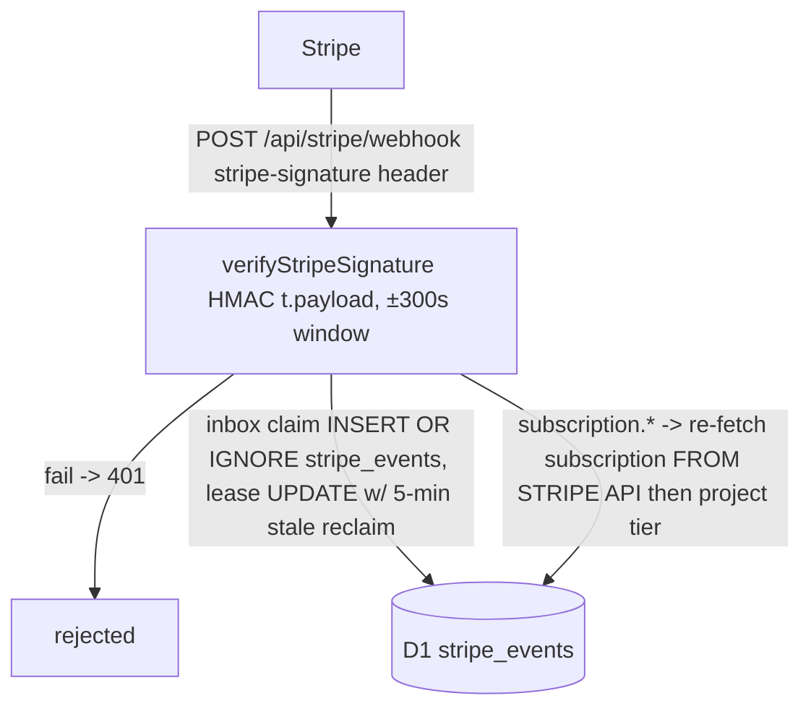

# Knowledge Base Report — PyRo1121/omg-web

> Stage 03 (P3, deep mode). Built from source at commit `6eb3c8e` (main).
> Prior phases folded in: `advisory-summary.md`, `sbom.json`, `patch-bypass-summary.md`, `candidates-summary.md`.
> This KB drives Phases 4–11; every named file/line below was read during P3 discovery.

## Project Classification

- **Primary**: Multi-worker web application + API (Cloudflare Workers / workerd).
- **Sub-types**:
  - `omg-site` — SolidStart SSR marketing site + authenticated web app (dashboard/admin), served via Workers Static Assets (`site/wrangler.toml`, domain `omg.latham.cloud`).
  - `omg-saas` — SaaS REST API worker: passwordless auth (OTP), licensing, CLI telemetry ingest, Stripe billing/webhooks, admin analytics (`site/workers/src/worker.ts`, domain `omg-api.latham.cloud`).
  - `workers/router`, `workers/releases` — standalone workers kept **in-repo only, not deployed** (reverse docs proxy; R2 release artifact server).
- External consumer: Rust CLI (`PyRo1121/omg`, out of repo) calls the pre-auth licensing/telemetry endpoints.
- Not a library/protocol → Mode A does not apply; Modes B and C apply (see Domain Attack Research).

## Architecture Model

### Components (seeded from sbom.json, verified against source)

| Unit | Runtime | Role | Evidence |
|---|---|---|---|
| `omg-site` | workerd (nodejs_compat) | SSR pages `/`, `/login`, `/signup`, `/dashboard`, `/admin`; static assets binding `ASSETS`; Better Auth server at `/api/auth/*`; BFF `/api/dashboard`, `/api/licensing/*` | `site/wrangler.toml`, `site/src/routes/*`, `site/src/lib/auth.ts` |
| `omg-saas` | workerd | 60-route REST API dispatched by exact method/path switch over shared `LicensingRoutes` registry; cron `0 2 * * *` (docs-analytics cleanup); Sentry wrapper | `site/workers/src/worker.ts`, `site/shared/licensing-routes.ts` |
| Cloudflare D1 `omg-platform` | datastore | **One physical database shared by both workers**: Better Auth tables (user/session/account/verification) + customers/sessions/licenses/machines/telemetry/stripe inbox | both `wrangler.toml` files, same `database_id fee8ddab-…` |
| Stripe | external-service | checkout/portal/balance REST + signed webhook ingress | `site/workers/src/handlers/billing.ts` |
| CF Email Sending (`EMAIL` binding) | external-service | OTP delivery (new path, HEAD commit `6eb3c8e`) | `site/workers/wrangler.toml`, `handlers/auth.ts:cloudflareMailer` |
| Turnstile | external-service | **Optional** bot check on OTP send | `handlers/auth.ts:requireTurnstile` |
| Service binding `LICENSING_API` → omg-saas | intra-cloud RPC | Same-origin BFF proxying + session minting | `site/wrangler.toml [[services]]`, `site/src/lib/licensing-bff.ts` |

### Transports
Public HTTPS to two custom domains; intra-cloud service binding; D1 SQL; send_email binding; Stripe webhook ingress; cron trigger; Cloudflare Cache API (github-proxy).

### Trust Boundaries

1. **Internet → `omg.latham.cloud`** (public site; static assets + SSR; `workers_dev = true` also exposes a `*.workers.dev` subdomain — bypass lane around any custom-domain-only edge rules).
2. **Internet → `omg-api.latham.cloud`** (~25 routes reachable with no credential: auth/OTP, license ops, telemetry ingest, webhooks, badge).
3. **Browser → omg-site BFF → omg-saas** (service binding; trust mediated by `X-Admin-Secret` header + Better Auth identity projection).
4. **omg-site ↔ omg-saas shared D1** — ownership-by-convention ("Better Auth owns only its four auth tables"), no enforcement mechanism; two codebases write `customers`/`sessions` with different schema assumptions.
5. **Secrets plane**: `STRIPE_SECRET_KEY`, `STRIPE_WEBHOOK_SECRET`, `JWT_SECRET`, `ADMIN_API_SECRET`, `BETTER_AUTH_SECRET`, OAuth client secrets; optional `TURNSTILE_SECRET_KEY`. Legacy `RESEND_API_KEY` listed as still-required in comments though email moved native.
6. **Stripe → webhook handler** (HMAC signature gate).
7. **CLI fleet → telemetry/licensing endpoints** (license-key bearer credentials, anonymous install pings).

### Identity model (two parallel principals)

- **Better Auth principal** (browser): `user.role` column ('admin'/'user') in shared D1; cookie session; checked via `requireAdmin()` (`site/src/lib/admin.ts`) and inline `auth.api.getSession` (`routes/api/dashboard.ts`, `routes/api/licensing/[...path].ts`).
- **Worker principal** (dashboard data-plane): `customers.admin` flag + opaque bearer session in `sessions` table; checked via `validateSession` (`site/workers/src/api.ts:validateSession`), `requireSession`/`requireAdminSession` (`admin-auth.ts`), or per-handler `validateAdmin` (`handlers/admin.ts:255`).
- The two are bridged server-side by `POST /api/internal/site-session`: Better Auth identity + role is projected onto a Worker customer row and session (`mintSiteSession`). Admin status exists in **two stores** that must stay in sync — a Phase 5 invariant to test.

## DFD/CFD Slices

### DFD-1: Anonymous OTP sign-in (highest-risk browser flow)

```mermaid
flowchart LR
  A[Anonymous browser] -->|POST /api/auth/send-code {email, turnstileToken?}| W[omg-saas worker]
  W -->|Turnstile optional - fail-open if secret unset| T[CF siteverify]
  W -->|D1 count >= 3 per email/10min| D[(D1 auth_codes)]
  W -->|EMAIL.send OTP plaintext| E[CF Email Sending]
  A -->|POST /api/auth/verify-code {email, code}| W
  W -->|HMAC-SHA256(JWT_SECRET, ctx+email+code) digest lookup, atomic claim UPDATE, attempt_count < 5| D
  W -->|find-or-create customer + free license, INSERT session 30d, prune > 5| D
  W -->|token = 32-byte hex in JSON body| A
```

Sinks: D1 writes, email send, HMAC key use. Attacker inputs: email, code, turnstile token, IP/UA (stored).

### DFD-2: Pre-auth licensing / CLI activation

```mermaid
flowchart LR
  C[Rust CLI / attacker] -->|GET/POST /api/validate-license key=…&machine_id=?| W[omg-saas]
  W -->|license lookup by key, status/expiry checks| D[(D1 licenses/machines)]
  W -->|machine seat accounting skipped when machine_id absent| D
  W -->|HS256 JWT {sub,tier,features,lic,mid} exp 7d signed w/ JWT_SECRET (or EdDSA w/ JWT_PRIVATE_KEY)| C
  C -->|POST /api/report-usage, /api/analytics, /api/cli/event,batch w/ license_key| W --> D
  A2[Anonymous] -->|GET /api/get-license?email=victim@…| W -->|masked license_key + tier/status/machine-count| A2
```

### DFD-3: Stripe webhook → entitlement projection



Note the reconcile-from-source pattern: entitlements are derived by re-fetching from Stripe, not trusted from event body (good); invoice/customer events do trust body fields for row inserts.

### DFD-4: Unauthenticated telemetry ingest → admin dashboard render (stored-XSS candidate chain)

```mermaid
flowchart LR
  A[Anyone] -->|POST /api/analytics events[].properties.message / POST /api/site/analytics/track| W[omg-saas]
  W -->|error_message upsert ON CONFLICT occurrences+1; raw properties JSON stored| D[(analytics_errors / analytics_events / site_* tables)]
  Adm[Admin browser] -->|GET /api/admin/firehose, /api/admin/* dashboards| W -->|rows rendered by AdminDashboard components| Adm
```

### CFD-1: Privilege transition — Better Auth role → Worker admin

```mermaid
flowchart TD
  B[Browser w/ Better Auth session] -->|any /api/licensing/* route| R[routes/api/licensing/[...path].ts]
  R -->|auth.api.getSession + user.role lookup| D[(better_auth user table)]
  R -->|same-origin Origin==url.origin required for non-GET; allowlist isSiteBffRoute; body <= 1MiB| P[proxyLicensingRequest]
  P -->|POST internal /api/internal/site-session X-Admin-Secret ADMIN_API_SECRET| W[omg-saas mintSiteSession]
  W -->|find-or-create customer; SYNC customers.admin := role; return/reuse active session token| D2[(customers/sessions)]
  P -->|Authorization Bearer minted token| W
```

Critical invariant: `role:'admin'` in the mint request elevates the customer row. The value originates from the Better Auth `user.role` column — anything that can write that column (sign-up metadata, admin plugin absence, direct D1 access from either worker) escalates to full admin API.

### CFD-2: Admin enforcement topology (omg-saas)

Router (`worker.ts`) dispatches directly to handlers; there is **no middleware layer**. Enforcement is inside each handler:
- `forbiddenUnlessAdminSession(request, env)` — router-level for exactly 5 routes (`/api/docs/analytics/dashboard`, `/api/site/analytics/{geo,realtime,overview}`) (`worker.ts:249-271`).
- `withAdminContext → validateAdmin` — all ~22 `/api/admin/*` handlers (`handlers/admin.ts:255-286`).
- `requireAdmin` in billing (`handlers/billing.ts:requireAdmin`).
- `requireSession` only (no admin flag) — account-dashboard/session/team routes (`handlers/dashboard.ts` ×10 call sites, `account-dashboard.ts:163`).
A new route added to the switch without its guard is silently public → structural missing-guard risk (Phase 5 route matrix must diff switch cases against guard calls).

## Attack Surface

Attacker-controlled inputs:
- JSON bodies (Effect Schema validated at boundary via `decodeJsonBody`), query params (`days` clamped 1–90; `limit` clamped 1–100; `email`; `key`), `Authorization: Bearer`, `X-Admin-Secret`, `Origin`, `stripe-signature`, `CF-Connecting-IP`/`User-Agent` (edge-set, hashed into visitor IDs, stored in audit logs), arbitrary nested `properties` objects persisted verbatim.
- Execution environments: production workerd only (dev tooling vite/vitest/wrangler never deployed); scheduled handler (cron).

## Key Dependencies

Security-relevant subset (full inventory in `sbom.json`; CVE posture verified against OSV at audit time):

| Dependency | Version | Notes |
|---|---|---|
| better-auth | 1.7.1 | Highest advisory density historically (22 GHSAs) but **0 affect 1.7.1** (OSV query at P3). Most recent ecosystem advisory GHSA-qq9h (2026-07-24, pre-account hijacking on magic-link/email-OTP) is relevant to this app's *custom* OTP flow. Config uses no plugins; `trustedOrigins=[baseUrl]`; emailAndPassword enabled. |
| drizzle-orm | 0.45.2 | CVE-2026-39356 fixed exactly at this pin — zero margin. All observed queries parameterized; one dynamic SET fragment (`admin.ts:1482`) built from fixed literals only. |
| effect | 3.22.1 | Schema boundary decoding everywhere (strong positive control); past fiber-context CVE past fix. |
| solid-js / @solidjs/start | 1.9.15 / 1.3.2 | JSX XSS history (past fix). Watch `innerHTML`/`@html` in dashboard components fed by telemetry rows. |
| hand-rolled JWT | – | License JWT minted in `handlers/license.ts:generateLicenseJWT` (HS256 default, EdDSA optional). No verification code in repo (consumer is out-of-repo CLI) — alg-confusion/key-selection risk lives at the CLI, flag cross-repo. |
| vite/vitest/wrangler/postcss | dev | Numerous advisories, dev-only reachability; `allowScripts`: esbuild, workerd, @parcel/watcher. |
| transitive overrides | pinned | h3/tar/minimatch/follow-redirects/node-forge/serialize-javascript/nitropack — evidence of prior supply-chain exposure; renovate watches pins. |

## Framework Contracts and Hidden Control Channels

1. **No middleware on omg-saas.** Exact method/path switch over `LicensingRoutes`; each route's `authentication:` field in the shared registry is *declarative documentation*, not enforced by the dispatcher — drift between registry and handler guards is invisible to types.
2. **Edge-trusted headers.** `CF-Connecting-IP` keys rate limits, visitor-ID hashing, and audit rows; safe on CF ingress, but any future non-CF fronting breaks this assumption.
3. **Fail-open controls** (three independent ones):
   - Turnstile skipped entirely when `TURNSTILE_SECRET_KEY` unset (`auth.ts:requireTurnstile`).
   - Rate limiter bindings skipped when undefined (`telemetry.ts:checkRateLimit` returns allowed; `docs-analytics.ts`, `site-analytics.ts` guard on `if (env.API_RATE_LIMITER)`).
   - `AUTH_RATE_LIMITER` and `ADMIN_RATE_LIMITER` are declared in wrangler.toml + Env but **never referenced by any handler code** — the "10 req/min/IP brute-force protection" comment in wrangler.toml describes a control that does not exist. OTP send is limited only by a per-email D1 count (3/10min), which an attacker rotates trivially across victim emails.
4. **Same-origin contract in BFF**: state-changing `/api/licensing/*` requires `Origin === url.origin`; GET/HEAD exempt (readable cross-origin subject to CORS of the site, which is not set on these routes).
5. **Internal transport trust**: `/api/internal/site-session` gated solely by `X-Admin-Secret` constant-time compare, fail-closed when unset (`admin-secret.ts`); reachable only via service binding in normal topology, but it is on the same public custom domain — anyone on the internet can *reach* it; only the secret protects it.
6. **SolidStart server functions** (`'use server'` in `routes/*.tsx`) compile to hidden RPC endpoints under vinxi/nitro server-fns manifest — these are additional unenumerated HTTP surface carrying the `requireAuth`/`requireAdminPage` guards.
7. **Runtime mode**: single production environment; no dev/prod branch logic except `dist/_worker.js` build artifact being the deploy target (`site/dist/**` present in repo — source/build skew is auditable noise for SAST).
8. **Cache behavior**: github-proxy caches per full URL (query string included) with stale-while-revalidate; response headers sanitized to prevent duplicate-CORS header construction bug (documented in-file).
9. **CORS**: hard allowlist `https://omg.latham.cloud` everywhere; `Access-Control-Allow-Credentials: true` on Better Auth catch-all; BFF strips `Set-Cookie`/CORS headers from downstream worker responses.

## Threat Model

**Assets** (ranked): ① D1 `omg-platform` (PII emails, session tokens, license keys, admin flags, Stripe linkage); ② secrets `JWT_SECRET` (dual-use: OTP HMAC + license-JWT HS256 signing), `ADMIN_API_SECRET`, `STRIPE_SECRET_KEY`, `BETTER_AUTH_SECRET`; ③ admin API read/write over all customer data + CSV exports; ④ entitlement integrity (tier/tier features projected to paying customers); ⑤ email reputation (OTP sending abused as mail relay if unthrottled); ⑥ release artifacts (R2, not deployed).

**Threat actors**: anonymous internet attacker (largest surface); malicious tenant/customer (cross-tenant IDOR within dashboard endpoints); paying-but-disgruntled CLI user (license abuse, seat evasion, telemetry poisoning); compromised Better Auth account low-privilege user (→ admin escalation via role sync); Stripe-out-of-band attacker (replay/spoof — well mitigated).

**Priority attack scenarios**:
1. OTP abuse: rotate victim emails through `send-code` (no IP throttle, Turnstile off by default) → email bombing / enumeration; targeted 6-digit brute force bounded by 5 attempts/code and single-active-code policy (well-built, verify race safety under concurrency in P5/P7).
2. Account takeover chain: pre-account hijacking analog — OTP flow auto-creates customers on first verify; attacker who controls verification for a victim email before the legitimate owner signs up permanently binds the identity (GHSA-qq9h pattern, self-built variant).
3. Admin escalation: any primitive that sets Better Auth `user.role='admin'` or `customers.admin=1` outside the intended sync → total compromise via `/api/admin/*` (exports include full PII CSVs).
4. Entitlement fraud: `validate-license` without `machine_id` returns valid tier/features/JWT without consuming a seat; usage reporting trusts caller-supplied license_key only.
5. Stored XSS into admin console via telemetry `properties.message` / site-analytics fields rendered by dashboard components.
6. D1 quota/DoS: unauthenticated writes to ≥6 telemetry tables on a Free-plan shared database.
7. Secret-scoped confusion: `JWT_SECRET` reuse means license-JWT forgery ⇒ OTP-digest forgery and vice versa if either leaks.

## Domain Attack Research

Mode B (security-sensitive dependencies) + Mode C (domains: passwordless/OTP auth, JWT licensing, Stripe webhooks, telemetry ingestion, SSRF-lite proxies). Live OSV research performed at P3 (better-auth: 22 lifetime GHSAs reviewed, 0 affecting pin; latest published 2026-07-24).

| Domain | Attack classes | Custom SAST targets | Manual review checklist |
|---|---|---|---|
| OTP/passwordless auth | brute force, code rotation, enumeration (response/status deltas), pre-account hijack, email bombing, race on code claim | `sendVerificationCode` callers; any path returning distinct errors for known vs unknown email | Concurrency of atomic claim UPDATE; attempt_count increment on last-attempt; session pruning correctness; whether verify-session acts as unthrottled token oracle |
| Licensing/JWT | key theft, seat-limit bypass, alg confusion (consumer side), token replay, tier forgery | `generateLicenseJWT` + `resolveSigning`; all readers of `body.machineId` | machine_id-absent validation semantics; JWT claims trusted by CLI; key separation JWT_SECRET vs BETTER_AUTH_SECRET |
| Stripe webhooks | spoof (HMAC), replay (>300s), partial-failure inbox states, entitlement injection via crafted events | `claimStripeEvent` state machine; `reconcileStripeSubscriptionSignal` fetch-before-project | invoice.paid trusting `invoice.customer` linkage; customer.created auto-link by email (pre-account bind vector: Stripe customer with victim email links to existing local account) |
| Telemetry ingestion | poisoning, stored XSS, quota exhaustion, ReDoS (none found), truncation bypass | every `INSERT INTO analytics_*` sink; renderers of `properties`/`error_message` in `site/src/components/dashboard/**` | HTML escaping at render; batch caps enforced server-side (500 events/1MB present) |
| better-auth integration | originCheck bypass class, callback state handling, session lifecycle | `createAuth` config drift; every `trustedOrigins` consumer; `/api/auth/[...auth]` header mutation loop | plugin surface disabled (good); cookie attributes; sign-up field filtering (`role` must not be client-settable) |
| Proxies/caches | cache-key flooding, host/header injection | `handleGitHubProxy` cache key; `workers/router` header rewriting (`prepareOriginHeaders`) | router not deployed but in-repo: fixed-origin fetches only, no open-proxy |

Sharp-edges/insecure-defaults sweep results (folded into scenarios above): three fail-open controls (§ Framework Contracts #3); dual-purpose `JWT_SECRET`; declarative-vs-enforced authz registry; `workers_dev=true`.

## Phase 4 CodeQL Extraction Targets

| DFD slice | Source type | Sink kinds |
|---|---|---|
| DFD-1 OTP flow | RemoteFlowSource (request bodies, headers) in `site/workers/src/handlers/auth.ts` | sql-execution (D1 prepare/bind), crypto (HMAC), http-request (turnstile siteverify), email-send |
| DFD-2 licensing | RemoteFlowSource (query params `key`,`machine_id`,`email`; JSON bodies) in `handlers/license.ts` | sql-execution, crypto (JWT sign) |
| DFD-3 stripe webhook | RemoteFlowSource (raw body text, `stripe-signature` header) in `handlers/billing.ts` | http-request (api.stripe.com), sql-execution |
| DFD-4 telemetry | LocalUserInput-equivalent persisted payloads (`properties`, `error_message`, UA/IP) flowing `handlers/{license,telemetry,site-analytics,docs-analytics}.ts` → D1 → `handlers/{firehose,admin}.ts` responses | sql-execution, stored-XSS second-order (model as DB-tainted source → response) |
| CFD-1 BFF | RemoteFlowSource (Better Auth session, Origin header) in `site/src/routes/api/licensing/[...path].ts`, `site/src/lib/licensing-bff.ts` | http-request (service-binding fetch), header-injection (`X-Admin-Secret`, Authorization) |

Extraction notes: TypeScript only (single language); exclude `site/dist/**`, `site/.vinxi/**`, `**/node_modules/**`, `site/test-results/**`; include `workers/*/src` and `tools/oxlint` at low priority.

## Spec Gap Candidates (for Phase 9)

- No explicit spec/RFC implemented in-repo. Candidate commitments inferred from code/docs prose:
  - GDPR/CCPA compliance claims in `handlers/privacy.ts` header comments ("Available globally to all users") — retention/deletion promises vs actual DELETE coverage.
  - Stripe webhook processing guarantees implied by inbox statuses (`received/processing/processed/failed`, Retry-After 409 semantics).
  - License/seat contract implied by `TIER_FEATURES` (max_machines enforcement completeness).
  - OTP email content promises ("expires in 10 minutes", 5-attempt limit) vs implementation constants.

## Coverage Gaps

- `workers/releases` has no package.json — dependency closure unresolved (sbom gap).
- Core Rust CLI (the actual JWT/license consumer) is out of repo; half of the licensing protocol is unauditable here.
- `site/dist/**` build artifacts committed — SAST must not treat generated bundles as first-party source.
- SolidStart compiled server-function endpoints (nitro server-fns manifest) are generated surface; enumerated best-effort from `'use server'` markers only.
- Shared-D1 schema drift risk: migrations live in `site/workers/migrations` (canonical) plus `migrations-legacy/`; `site/drizzle/migrations` separate — no single authority visible for which migrations actually ran.

## Static Analysis Summary

Stage 04 (P4) completed 2026-08-23. Tooling: CodeQL CLI (downloaded to
`~/.local/share/codeql-cli`) + `codeql/javascript-queries@2.4.3`; Semgrep OSS 1.174.0
(uv install). **Semgrep Pro unavailable** — `semgrep --pro` fails with "Run
`semgrep login` before running `semgrep scan --pro`" (no SEMGREP_APP_TOKEN in
environment); documented fallback to OSS per execution policy. CodeQL RemoteFlowSource
does not model Workers `Request` objects out of the box, so worker-side sources were
enumerated via custom queries + manual tracing instead of taint graphs.

### Passes run

| Tool | Ruleset | Results |
|---|---|---|
| Semgrep OSS | p/security-audit, p/secrets, p/owasp-top-ten | 0 findings (155 rules / 298 files) |
| Semgrep OSS | p/typescript, p/xss, p/jwt | 0 findings (142 rules) |
| Semgrep OSS | custom domain rules (`piolium/semgrep-rules/custom-domain.yaml`, 10 rules) | 29 structural candidates → triaged below |
| CodeQL | codeql-suites/javascript-security-and-quality.qls | 2 Low/correctness findings |

Exclusions applied everywhere: `node_modules`, `site/dist`, `.vinxi`, `test-results`,
generated `workers/worker-runtime.d.ts`, tests (kept visible for context but not
findings-bearing).

### Custom artifacts

- `piolium/codeql-queries/remote-sources.ql`, `security-sinks.ql`, `qlpack.yml`
- `piolium/semgrep-rules/custom-domain.yaml` — admin-secret plain-compare,
  spoofable-IP security decisions, CORS origin reflection (taint), variable-URL fetch,
  JWT HMAC sign, D1 interpolated SQL, unverified webhook JSON.parse, cache-key taint,
  session-from-raw-headers, variable redirect.
- `piolium/codeql-artifacts/{entry-points,sinks,call-graph-slices}.json`,
  `flow-paths-raw.sarif`, `merged-sast.sarif`, db retained at
  `piolium/codeql-artifacts/db`.
- Required artifact: `piolium/attack-surface/source-sink-flows-all-severities.md`.

### Coverage tradeoffs

- Pro taint passes skipped (licensing fallback): cross-file/interfile taint gaps
  compensated by manual source→sink tracing of all 8 high-risk slices (DFD-1..4, CFD-1
  + proxy/cache slices).
- CodeQL JS taint on Workers sources requires custom source modeling; deferred to
  Phase 7 if needed (db retained).
- No batching/throttling required; repo small enough for single-pass runs.

## CodeQL Structural Analysis

Database: `piolium/codeql-artifacts/db` (javascript extractor, 251 files, build-less).

| Metric | Value |
|---|---|
| Entry points enumerated | 30 (`entry-points.json`; worker.ts route table + SolidStart API routes + router worker) |
| Security sink call sites | 567 (`sinks.json`: prepare 377, fetch 89, set 62, match 19, batch 9, put 3, sign 6, send 1, redirect 1) |
| Remote sources (CodeQL native, browser-side) | 12 |
| Documented source→sink slices | 8 (`call-graph-slices.json`, mapped to DFD-1..4 / CFD-1 + proxies) |

Entry points absent from Phase 3 DFD slices: `/api/badge/installs`, `/health`,
`/api/auth/verify-session`, `/api/auth/logout`, all `/api/team/*` dashboard routes —
all reviewed; auth gates verified present (session or none-by-design).

Sinks mapping to unmodeled high-risk flows: Cache API `put/match` keyed by raw request
URL (github-proxy, docs router) and service-binding fetch carrying `X-Admin-Secret`
(BFF) — both now covered by manual slices SLICE-GITHUB-CACHE and SLICE-BFF-LICENSING.

CodeQL suite findings (both Low):
1. `js/incomplete-url-substring-sanitization` — `site/src/lib/analytics-client.ts:575`
   (`href.includes('github.com')` CTA categorization). Correctness only; no security
   decision depends on it.
2. `js/useless-assignment-to-local` — `AdminDashboard.tsx:459`. Quality only.

## SAST Enrichment

Inline classification of every candidate ≥ Low. Per policy, Low-severity items are
dropped immediately and recorded here for traceability.

| Finding | Classification | Attacker Control | Boundary | CodeQL Reachability | Verdict |
|---|---|---|---|---|---|
| p4-001 turnstile-fail-open | security (env-conditional) | full (unauthenticated OTP path) | internet → auth worker | no-slice (config gate, manual) | keep |
| p4-002 stripe email auto-link | security | partial (signed event, attacker-shaped email) | Stripe → worker → victim account row | no-slice (manual slice SLICE-STRIPE-WEBHOOK) | keep |
| p4-003 JWT_SECRET dual-use | security (crypto hygiene) | none without prior secret leak | licensing ↔ auth domains | no-slice (key usage, manual) | keep |
| p4-004 seat-limit TOCTOU | security/business-logic | license holder (authenticated-ish) | monetization boundary | no-slice (manual slice SLICE-LICENSE-JWT) | keep |
| p4-005 shared ADMIN_API_SECRET role minting | security (design) | secret holder; public endpoint reachable | BFF ↔ internal worker service boundary | no-slice (manual slice SLICE-BFF-LICENSING) | keep |
| semgrep omg-d1-interpolated-sql @ admin.ts:1482 | correctness (false positive) | admin-only body fields | admin session | n/a | drop — fragments are compile-time whitelist literals (`content = ?`, `is_pinned = ?`), values bound |
| semgrep omg-d1-interpolated-sql @ site-analytics.ts:68 | correctness (false positive) | none | server-generated salt | n/a | drop — `${saltHex}` is crypto.getRandomValues hex, never user input |
| semgrep omg-admin-secret-plain-compare @ site-session.ts:75/108/109 | correctness (false positive) | none | — | n/a | drop — comparisons are role flags/row checks; actual secret compare is timing-safe in `admin-secret.ts` |
| codeql js/incomplete-url-substring-sanitization @ analytics-client.ts:575 | correctness | DOM href (self-page) | browser-only | reachable: true (client runtime) | drop — CTA label categorization, no security decision |
| codeql js/useless-assignment-to-local @ AdminDashboard.tsx:459 | correctness | none | — | n/a | drop — quality |
| github-proxy cache-key flooding (unbounded query-string keys) | env/tooling | full | edge cache per colo | no-slice | drop (Low) — bounded impact, caches.default evicts; noted in flows doc |
| /api/auth/verify-session token oracle (unthrottled, returns user info for valid tokens) | env/admin-equivalent | requires valid UUIDv4 token | same-user | no-slice | drop (Low) — token knowledge ≡ ownership; guessing infeasible |
| workers/router forwards client X-Forwarded-* to origins | environment | header values | edge → origin | no-slice (SLICE-ROUTER-HEADERS) | drop (Low/env) — router not deployed per P3 recon; flagged for deployment review |
| docs/site analytics unauthenticated ingestion poisoning | env/integrity | full event content | ingestion → internal dashboards | no-slice (SLICE-TELEMETRY) | drop (Low) — rate-limited, Solid-escaped rendering (no innerHTML/@html anywhere), metrics-integrity only |
| report-usage MAX-upsert metric inflation | integrity | valid-license holders | CLI → billing dashboards | no-slice (SLICE-TELEMETRY) | drop (Low) — inherent to client-reported usage design; no entitlement effect |

**Kept for Phase 10:** p4-001 … p4-005 drafts in `piolium/findings-draft/`.

## State & Concurrency Audit

- State-holding entities catalogued: 7 (auth_codes, customers, licenses, machines,
  sessions, stripe_events, analytics/usage counters) — full table in
  `attack-surface/state-concurrency-summary.md`
- Concurrency primitives observed: no app-level locks; atomicity only via D1
  `db.batch` and two well-built conditional single-statement writes (OTP claim,
  Stripe inbox claim); all other paths are check-then-act across round-trips
- Idempotency infrastructure: present only on Stripe webhooks (inbox + lease);
  absent on OTP send quota, customer find-or-create, machine seat accounting
- Drafts filed: 4 (double-submit ×1 HIGH, state-machine-violation ×1 HIGH,
  toctou ×1 MEDIUM, stale-read ×1 MEDIUM) + corroboration of p4-004 seat TOCTOU
  (not re-filed). Details: `piolium/findings-draft/p6-001…p6-004`.

**Unmodeled-flow watchlist for Phases 5–10:** (1) shared `ADMIN_API_SECRET` rotation
runbook; (2) Stripe customer-linkage audit query (`SELECT email FROM customers WHERE
stripe_customer_id IS NOT NULL` vs Stripe side); (3) `workers/router` deploy gating.

## Authorization Audit

Stage 05/06 authorization auditor (deep mode) completed against commit `6eb3c8e`.

- Endpoints enumerated: **84** (68 omg-saas exact-switch routes, 12 omg-site route groups incl. 2 compiled
  server-fns, 2 latent workers, 1 cron; cross-checked against `codeql-artifacts/entry-points.json`)
- Frameworks covered: Cloudflare Workers exact method+path switch dispatcher (no middleware), SolidStart
  file routes + `'use server'` RPC, Better Auth catch-all, service-binding BFF
- Dynamic/unresolved endpoints: 6 items (see `piolium/attack-surface/authz-coverage-gaps.md`) — nitro
  server-fns manifest, undeployed router/releases workers, out-of-repo CLI JWT consumer, admin-flag sync
  invariant, production limiter-binding presence, shared-D1 schema authority. No endpoint left with
  Expected Scope `unknown`.
- Drafts filed: **4** (`p5-001`…`p5-004`) — hidden-control-channel ×1 (`p5-001`, Origin-Finding p4-005),
  authz-missing-guard ×1 (`p5-002`, overlaps p7-003 — dedupe noted), idor-bola/enumeration ×1 (`p5-003`),
  inconsistent-guard/registry-drift ×1 (`p5-004`)
- Matrix: `piolium/attack-surface/public-routes-authz-matrix.md`
- Unauthenticated surface: `piolium/attack-surface/unauthenticated-surface.md` (**17** pre-auth entry
  points, **2** flagged missing-guard/middleware-gap: `/api/get-license` p5-003,
  `/api/internal/site-session` p5-001; rate-limiter gap p5-002 spans rows 2–4)
- Positive structural results: zero missing guards on the authenticated plane; all user-owned queries
  bind session-derived `customer_id`/`license_id`; no mass assignment (allowlisted schemas everywhere);
  no in-body vertical-escalation primitive (role writes reachable only via ADMIN_API_SECRET).

## Cross-Service Taint Propagation

Stage 09 (P9, deep mode) completed 2026-08-23 against commit `6eb3c8e`. Full detail:
`attack-surface/cross-service-edges.md` + `cross-service-edges.json`; drafts
`findings-draft/p9-001`, `p9-002`.

- Services analysed: 4 (omg-site, omg-saas deployed; router, releases latent/in-repo)
- Edges stitched: 8 (3 http/service-binding, 3 db-write-driven shared-D1, 1 latent http-proxy, 1 latent R2; 0 gRPC, 0 queue — no broker in repo)
- Boundary assessment: E001/E002 BFF controls verified strong (exact-path allowlist after normalization, 1MiB cap, response-header stripping, per-request fresh identity re-read); E003 secret-gated fail-closed but publicly reachable — deduped against p4-005/p5-001, not re-filed; no cross-service SSRF (router origins env-fixed); Stripe replay already covered by DFD-3
- Coverage gaps: unversioned `user_stats`/`user_cohorts` views (`admin.ts:653,1032`) absent from every migration directory; latent workers undeployed; out-of-repo Rust CLI performs all license-JWT verification; nitro server-fns build-only surface
- Drafts filed: 2 (transitive-trust ×1 — p9-001 shared-D1 ownership-by-convention making both admin planes mutually reachable through storage; dead-channel ×1 — p9-002 admin CRM consuming views defined nowhere in the repo)

## Spec Gap Analysis

Stage 07 (P7). Full detail: `piolium/attack-surface/spec-gap-summary.md`; drafts `piolium/findings-draft/p7-001..004`. No formal RFC implemented in-repo; analysis applied the Phase 3 spec-gap candidates plus framework-contract/hidden-control-channel review of the dispatch router, BFF, server functions, and proxy/cache handlers.

### Gap: OTP/session expiry never enforced intra-day

- **RFC/Spec**: In-repo contract — OTP email text "expires in 10 minutes" (`handlers/auth.ts:160,175`); session TTL 30d
- **Requirement**: Code unusable after stated lifetime
- **Code Path**: `site/workers/src/handlers/auth.ts:251,342,369` and `workers/src/api.ts:284` — ISO-8601 `toISOString()` values TEXT-compared against `datetime('now')` ("YYYY-MM-DD HH:MM:SS"); `'T' > ' '` makes the check true all day
- **Gap Type**: canonicalization
- **Attack Vector**: code/token issued earlier same UTC day stays claimable up to ~24h instead of 10 min / 30d+24h
- **Exploit Conditions**: possession of a valid code/token from earlier today; brute force still capped at 5 attempts/code
- **Impact**: documented OTP lifetime control not enforced; widens pre-account-hijack/replay window ~×144
- **Severity**: MEDIUM
- **Evidence**: `expires_at DATETIME` col (`migrations/0000_current_baseline.sql:144`) written via `.toISOString()`; checks `expires_at > datetime('now')`

### Gap: Hardcoded dev fallback for BETTER_AUTH_SECRET

- **Contract**: SolidStart `'use server'` runtime must fail closed on missing secrets
- **Security Assumption**: cookie verification always uses deployed `BETTER_AUTH_SECRET`
- **Code Path**: `site/src/routes/dashboard.tsx:21-22` — `BETTER_AUTH_SECRET || 'dev-secret-change-me'`, `BETTER_AUTH_URL || 'http://localhost:3000'` inside `requireAuth` guard
- **Gap Type**: runtime-mode
- **Attack Vector**: unset/empty secret binding → dashboard sessions verified against public constant → forged cookies impersonate any user id on `/dashboard`; partially silent failure (auth handler path errors, dashboard doesn't)
- **Exploit Conditions**: deployment missing the secret binding (nothing in-repo enforces presence)
- **Impact**: account impersonation during degraded mode; fail-open secret handling
- **Severity**: MEDIUM
- **Evidence**: contrast fail-through `[...auth].ts:12-25` (no fallback)

### Gap: Documented rate-limit controls do not exist

- **Contract**: `site/workers/wrangler.toml:23-38` — AUTH_RATE_LIMITER "10 req/min/IP brute force protection", ADMIN_RATE_LIMITER "100/min/user"
- **Security Assumption**: auth/admin APIs rate-limited as configured
- **Code Path**: zero call sites for both bindings (only API_RATE_LIMITER used at `telemetry.ts:98`, `site-analytics.ts:257`, `docs-analytics.ts:44`, and it fails open); send-code throttled only per attacker-supplied email (3/10min)
- **Gap Type**: framework-contract
- **Attack Vector**: unbounded single-IP OTP email bombing/enumeration across victim emails; unthrottled admin-API credential attacks
- **Exploit Conditions**: production deployment as configured
- **Impact**: claimed brute-force protection absent; compounds p4-001
- **Severity**: MEDIUM
- **Evidence**: wrangler.toml comment vs grep showing no `AUTH_RATE_LIMITER`/`ADMIN_RATE_LIMITER` references in src

### Gap: GDPR deletion & retention promises contradict implementation

- **RFC/Spec**: `handlers/privacy.ts:1` (GDPR/CCPA claim), `:222-224` ("data has been deleted...irreversible"; audit logs 30 days), `:108` (licenses anonymized), Art. 17 baseline
- **Requirement**: erasure/anonymization + enforced retention windows
- **Code Path**: `privacy.ts:126-216` deletes 9 tables but leaves `customers.email/stripe_customer_id`, Better Auth user rows (same physical D1), `analytics_events`; license only status-flipped (not anonymized); no `DELETE FROM audit_log` purge exists anywhere (cron = docs-analytics only) while rows store raw IP+UA (`api.ts:logAudit`)
- **Gap Type**: missing-check
- **Attack Vector**: n/a attacker-driven — compliance divergence; enlarges PII exposed in any downstream breach/admin compromise
- **Exploit Conditions**: any deletion request; time passing for retention gap
- **Impact**: Art. 17 non-compliance despite header claim; indefinite IP/UA retention vs published 30 days
- **Severity**: MEDIUM
- **Evidence**: deletion batch statement list; repo-wide absence of audit_log purge jobs

**Verified-clean contracts (no finding)**: route-registry `authentication:` field currently matches enforcement everywhere (declarative-only risk recorded); exact-path dispatcher fail-closed incl. percent-encoding/trailing-slash/case; BFF same-origin fail-closed + response sanitization; Stripe inbox lease state machine; telemetry opt-out enforced at ingest; email canonicalization consistent; SolidStart server-function guards present.
